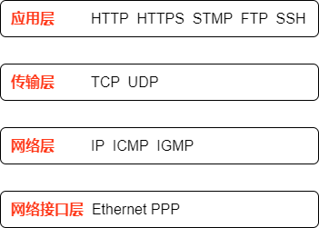
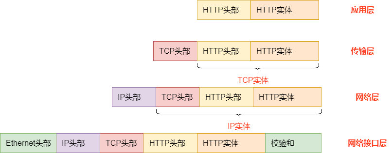

 

## 什么是TCP/IP协议栈
TCP协议栈就是包含应用层、传输层、网络层、网络访问层等4层协议的集合。

 
 
应用层：规定两个应用程序间通信的协议。常见的应用层协议有 HTTP、HTTPS、SMTP、FTP、SSH、DNS等

传输层：实现端到端的进程间通信，与应用层的区别是，传输层关心的是数据是否能到达对等端以及控制数据传输的速度，而应用层关系的是如何将数据展示给用户。传输层协议有TCP UDP等

网络层：实现主机到主机之间的通信，即一个IP包如何从源主机通过路由转发到目的主机，网络层协议有IP ICMP IGMP等

网络接口层：实现数据从源主机节点通过电信号传输目标主机节点，网络接口层协议有 Ethernet、PPP等

 
## 一个HTTP报文在客户端和服务器间的传输过程
 
 
 
**在源主机的处理**
1.	在应用层，客户端将HTTP报文的头部和实体准备好，然后向下交付给传输层
2.	在传输层，操作系统将HTTP报文作为TCP协议的实体，同时增加TCP协议的头部信息，TCP协议的头部信息包含源主机端口、目的主机端口、序列号、确认号等用于保证有序可靠传输TCP报文段的数据，然后向下交付给网络层
3.	在网络层，操作系统将TCP报文段作为IP协议的实体，同时增加IP协议的头部信息，IP协议的头部信息包括源主机IP、目的主机IP、协议版本、TTL等信息，然后向下交付给网络接口层
4.	在网络接口层，操作系统将IP包添加Ethernet协议的头部信息，包括源主机mac地址、目的主机mac地址，同时添加校验和，再通过网卡将01码的数据信号转换成电信号发送给目标主机
 
**在目标主机的处理**
1.	在网络接口层，网卡把电信号转换成数字信号，取出Ethernet头部信息和校验和判断数据是否再传输过程出错，再交付给网络层
2.	在网络层，操作系统取出ip包的头部信息，根据协议类型(TCP、UDP)将IP包的实体信息向上交付给传输层
3.	在传输层，操作系统取出TCP报文段的头部信息，再将TCP报文段的实体信息向上交付给应用层
4.	再应用层，HTTP服务端解析HTTP报文
 
## what's next?
在接下来的一系列文章，将以HTTP协议、TCP协议、IP协议、Ethernet协议为例，讲解每个协议层的负责的功能，以及协议分层设计的好处。